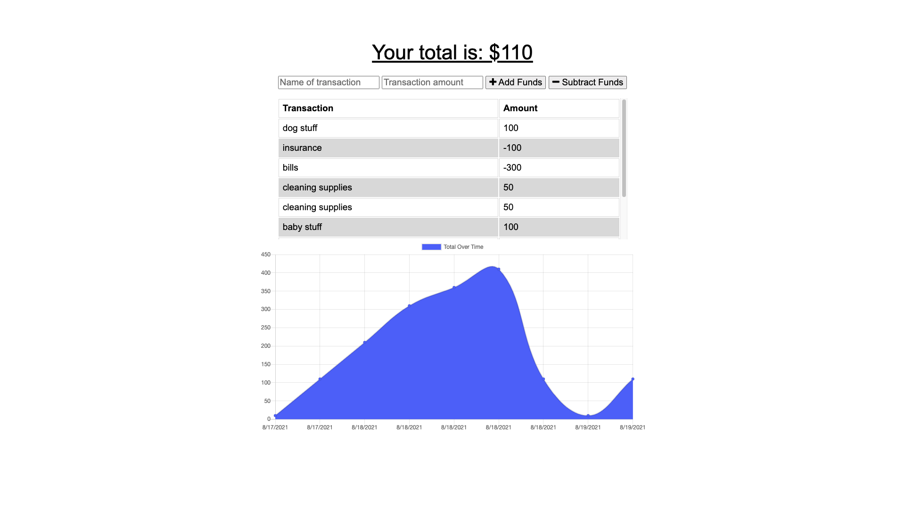

# Budget-Tracker

## Description:
- This application was created for the person who is always on the go. Sometimes in life we just don't have any internet access. With all of our banking info accessible with just a touch, we've become dependent on the internet to help us with our finances. With the Budget-Tracker, you'll be able to track your debits and credits even offline. Once you get back online, those transactions will be uploaded and reflected.

## Table of Contents:
- [Installation](#installation)
- [Usage](#usage)
- [Visual Sample](#visual)
- [Contributors](#contributors)
- [Github](#github)
- [Email](#email)

## Installation:
- Anyone can use this application by going to the website [here](https://lit-taiga-45772.herokuapp.com/)
- View the repository [here](https://github.com/ksapir/budget-trackers)

## Usage:
- Simply input the details and the application will show you where you're holding.

## Visual Sample:

## Contributors:
- Karen Pion

## Contact:
- Github: ksapir
- Email: karenlpion@gmail.com
